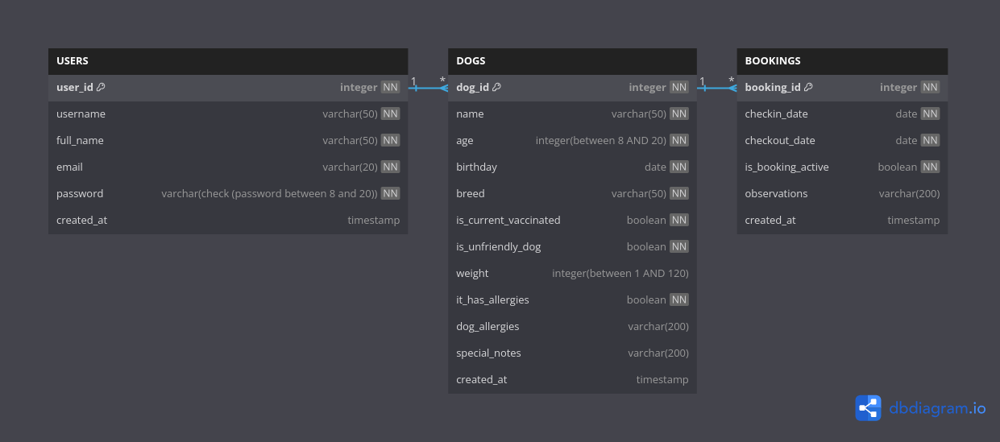

# ¡PERRIN! ¡PERROUT! API BEDU

## Equipo T1

- **Alan Fabian V.** - [@AlfaVQ](https://github.com/AlfaVQ)
- **Bruno Pérez C.** - [@BrunoPCH](https://github.com/BrunoPCH)
- **V. Citlalli Hernández B.** - [@CitlalliHdezBasilio](https://github.com/CitlalliHdezBasilio)

### Descripción

Api que sirve para realizar reservaciones de una pensión de perros que trata de seguir las buenas prácticas de REST.

### [ENLACE](http://20.84.146.46:8080/helloworld) de despliegue en Azure

### Funcionalidades de !Perrin! !Perrout!

#### Como usuario quiero:

- Poder registrarme para poder generar credenciales de acceso a las funcionalidades de la API
- Ingresar mis credenciales para utilizar las funcionalidades de la API
- Registrar perros para poder reservar fechas de pensión
- Listar mis perros registrados
- Editar los datos de mis perros
- Borrar mis perros registrados anteriormente
- Crear nuevas reservaciones asignadas a un perro
- Listar reservaciones realizadas asignadas a cada perro
- Editar las reservaciones realizadas
- Cancelar mis reservaciones realizadas anteriormente.

### Base de datos

Se emplea un modelo de Base de Datos Relacional mediante la dependencia Sequelize y se administra por medio de SQLite3.

Las validaciones se hicieron en:

- Base de datos SQL
- Por la dependencia Joi para NODE
- Y en el manejo de errores se emplea la dependencia express-joi-validation

[Enlace-del-diagrama](https://dbdiagram.io/d/PerrinPerrout-6526fd72ffbf5169f082f222)

### Rutas

#### Pruebas

- **GET/helloworld:** Da un saludo. \*Solo para pruebas
- **GET/goodbye:** Regresa una despedida. \*Solo para pruebas

#### Usuarios

- **GET/login:** Esta ruta te permite ingresar como usuario
- **POST/users:** Esta ruta te permite registrarte los datos que deberá tener son:
  - username
  - fullName
  - email
  - password
- **GET/users:** Regresa todos los usuarios registrados en Base de datos \*Solo para pruebas.
- **GET/users/:id:** Regresa un usuario seleccionado por su ID
- **PUT/users/:id:** Actualiza o modifica algún dato de un usuario seleccionado por su ID. Al menos debe de tener algún dato de los siguientes:
  - fullName
  - email
  - password
- **DELETE/users/:id** Elimina a un usuario de la base de datos

#### Perros

- **POST/dog:** Esta ruta te permite registrar perros a cada usuario, los datos que deberá tener son:
  - name
  - age
  - breed
  - vaccinated
  - unfriendly_dog:
  - weight:
  - has_allergies
  - allergies:
  - notes:
- **GET/dogs:** Regresa todos los perros registrados en Base de datos \*Solo para pruebas.
- **GET/dog/:id:** Regresa un perro seleccionado por su ID
- **PUT/dog/:id:** Actualiza o modifica algún dato de un perro seleccionado por su ID. Al menos debe de tener algún dato de los siguientes:
  - name
  - age
  - breed
  - vaccinated
  - unfriendly_dog:
  - weight:
  - has_allergies
  - allergies:
  - notes:
- **DELETE/dogs/:id** Elimina a un perro de la base de datos mediante su ID

#### Reservaciones

- **POST/bookings:** Esta ruta te permite registrar una reservación los datos que deberá tener son:
  - dogId
  - checkInDate
  - checkOutDate
  - observations
- **GET/bookings/:id:** regresa una reservación por su ID
- **GET/bookings:** Regresa todas las reservaciones registradas en Base de datos \*Solo para pruebas.
- **PUT/bookings/:id:** Actualiza o modifica algún dato de una reservación seleccionada por su ID. Al menos debe de tener algún dato de los siguientes:
  - checkInDate
  - checkOutDate
  - observations
- **DELETE/bookings/:id** Elimina una reservación de la base de datos.

### Trabajos realizados por los integrantes (ordenados alfabeticamente) | Créditos:

#### Alan Fabian V.

[@AlfaVQ](https://github.com/AlfaVQ)

**Desarrolló:**

- Autenticación

#### Bruno Pérez Ch.

[@BrunoPCH](https://github.com/BrunoPCH)

**Desarrolló:**

- Presentación
  - Esquemas de base de datos
- Código por Modelo Vista Controlador:
  - Usuarios
  - Reservaciones
  - Integración continua / despliegue continuo
  - Despliegue en Azure

#### V. Citlalli Hernández B.

[@CitlalliHdezBasilio](https://github.com/CitlalliHdezBasilio)

**Desarrolló:**

- Revisión de base de datos y modelos de base de datos de:
  - Usuarios
  - Reservaciones
  - Perros
- Código por Modelo Vista Controlador:
  - Perros
- Revisión y gestión de código en GitHub:
  - Resolvió conflictos de Ramas
  - Gestiono y aplico los cambios
